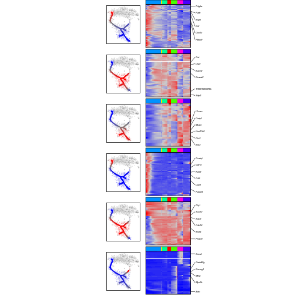

This vignette describes analysis of individual bifurcation points based on a reconstructed transcriptional tree. As example, it explores bifurcation point between sensory and autonomic nervous systems in neural crest. The guideline starts with tree reconstruction, identifies fate-specific genes and estimates timing of their activation, assess existence and formation of fate-biases, and predicts time of genes inclusion in fate-biased phase.

## Preliminaries: loading the libraries and neural crest data


```r
library(igraph)
library(mgcv)
library(quadprog) 
library(pcaMethods) 
library(Rcpp) 
library(inline) 
library(RcppArmadillo) 
library(pbapply)
library(crestree)
library(ggplot2); library(gridExtra); library(grid);

data(crest)
emb <- crest$emb
clcol <- crest$clcol
nc.cells <- crest$nc.cells
wgm <- crest$wgm
wgwm <- crest$wgwm # matrix of expression weights
fpm <- read.table("http://pklab.med.harvard.edu/ruslan/neural_crest/fpm.txt",header=TRUE)
fpm <- as.matrix(fpm)
genes.tree <- crest$genes.tree
```
  
## Run tree reconstruction
See manual [the guide for tree reconstruction](https://github.com/hms-dbmi/crestree/blob/master/vignettes/tree_guide.md) for detailed instructions. The tree can be either manually reconstructed:


```r
M <- length(nc.cells); 
lambda <- 250; 
sigma <- 0.04
ppt <- ppt.tree(X=wgm[,nc.cells], W=wgwm[,nc.cells], emb=emb, lambda=250, sigma=0.04, metrics="cosine", M=M, err.cut = 5e-3, n.steps=30, seed=1, plot=FALSE)
ppt <- cleanup.branches(ppt,tips.remove = c(139,295))
ppt <- setroot(ppt,355)
ppt <- project.cells.onto.ppt(ppt,n.mapping = 100)
```

Alternatively, the tree object used in the paper can be downloaded from:

```r
ppt <- readRDS(url("http://pklab.med.harvard.edu/ruslan/neural_crest/tree_structure_full.rds"))
```

## Identification of branch-specific genes

Bifurcation point is charactarized by a progenitor and derivative branches.

```r
plotppt(ppt,emb,tips=TRUE,forks=FALSE,cex.tree = 0.2,lwd.tree = 2)
```


We thus start with selection a root of progenitor branch (355) and two leaves of derivative branches (165 and 91):

```r
root <- 355
leaves <- c(165,91)
```

Here is a fork charactarizing sensory-autonomic bifurcation point:

```r
subtree <- extract.subtree(ppt,c(root,leaves))
plotppt(ppt,emb,tips=TRUE,forks=FALSE,cex.tree = 0.3,lwd.tree = 3,subtree=subtree)
```


A routine `test.fork.genes` performs assessment of genes differentially expression between post-bifurcation branches:

```r
fork.de <- test.fork.genes(ppt,fpm,root=root,leaves=leaves,n.mapping = 10)
## Error in dimnames(x) <- dn: length of 'dimnames' [1] not equal to array extent
```

A table `fork.de` contains summary statistics of fold change `effect`, p-value `p` and adjusted p-value `fdr`  of differential expression between branches, magnitude `pd1.a` (`pd2.a`) and p-value `pd1.p` (`pd2.p`) of expression changes from first (second) derivative branch to progenitor branch:

```r
head(fork.de[order(fork.de$p),],)
## Error in head(fork.de[order(fork.de$p), ], ): object 'fork.de' not found
```


```
## Error in head(fork.de[order(fork.de$p), ], ): object 'fork.de' not found
```

We next consider a gene to be preferentially expressed along the first (second) branch if it has `effect.b1` (`effect.b2`) increased expression compared to another post-bifurcation branch and significant increase (p < 0.05) relative to progenitor branch:


```r
fork.de <- branch.specific.genes(fork.de,effect.b1 = 0.1,effect.b2 = 0.3)
## Error in branch.specific.genes(fork.de, effect.b1 = 0.1, effect.b2 = 0.3): object 'fork.de' not found
```

Column `state` characterizes genes that are specific to first (1), second (2), or neither (0) of derivative branches.

```r
genes.sensory <- rownames(fork.de)[fork.de$state==1]
## Error in rownames(fork.de): object 'fork.de' not found
genes.autonomic  <- rownames(fork.de)[fork.de$state==2]
## Error in rownames(fork.de): object 'fork.de' not found
```

For consistency with the original results, we also limit genes to `genes.tree` set associated with the tree:

```r
genes.sensory <- intersect(genes.sensory,genes.tree)
## Error in intersect(genes.sensory, genes.tree): object 'genes.sensory' not found
str(genes.sensory)
## Error in str(genes.sensory): object 'genes.sensory' not found

genes.autonomic <- intersect(genes.autonomic,genes.tree)
## Error in intersect(genes.autonomic, genes.tree): object 'genes.autonomic' not found
str(genes.autonomic)
## Error in str(genes.autonomic): object 'genes.autonomic' not found
```

## Classification of early and late modules

Dynamics of gene expression is reflected in timing of activation and expression optimum. Routine `activation.fork` estimates timing of optimum expression of smoothed expression and activation point as a first passage of derivative through `deriv.cutoff` cutoff:


```r
fork.de.act <- activation.fork(ppt,fork.de,fpm,root,leaves,deriv.cutoff = 0.015,n.mapping=10)
## Error in rownames(fork.de): object 'fork.de' not found
```

`fork.de.act` table provides additional columns `optimum` and `activation` for genes predicted to be differentially expressed (`stat` = 1 or 2).

Branch-specific sets of genes (`genes.sensory` and `genes.autonomic`) can now be partitioned in early and late genes based on time of expression activation. A logical solution is to orient early/late genes relative to bifurcation point. Timing of root, bifurcation point and leaves are


```r
fork.pt(ppt,root,leaves)
```


| root| bifurcation|  leave 1|  leave 2|
|----:|-----------:|--------:|--------:|
|    0|     17.5719| 27.59971| 31.49521|

We use `cutoff=16.0` on timing of activation to define early and late genes:


```r
cutoff <- 16.0
```


```r
genes.sensory.late <- genes.sensory[fork.de.act[genes.sensory,]$activation > cutoff]
## Error in eval(expr, envir, enclos): object 'genes.sensory' not found
genes.sensory.early <- setdiff(genes.sensory,genes.sensory.late)
## Error in setdiff(genes.sensory, genes.sensory.late): object 'genes.sensory' not found

genes.autonomic.late <- genes.autonomic[fork.de.act[genes.autonomic,]$activation > cutoff]
## Error in eval(expr, envir, enclos): object 'genes.autonomic' not found
genes.autonomic.early <- setdiff(genes.autonomic,genes.autonomic.late)
## Error in setdiff(genes.autonomic, genes.autonomic.late): object 'genes.autonomic' not found
```

Now we can check if early/late genes modules follow co-activation or mutually-exclusive patterns:

```
## Error in apply(fpm[genes.sensory.early, ], 2, mean): object 'genes.sensory.early' not found
## Error in rownames(programs) = c("early sensory", "late sensory", "early autonomic", : object 'programs' not found
```


```r
cells <- rownames(ppt$cell.summary)[ppt$cell.summary$seg %in% extract.subtree(ppt,c(root,leaves))$segs]
par(mfrow=c(1,2))
plot(t(programs[c(1,3),cells]),col=ppt$cell.summary[cells,]$color,pch=19,cex=0.5)
## Error in t(programs[c(1, 3), cells]): object 'programs' not found
plot(t(programs[c(2,4),cells]),col=ppt$cell.summary[cells,]$color,pch=19,cex=0.5)
## Error in t(programs[c(2, 4), cells]): object 'programs' not found
```


## Coordination of fate biases

Co-activation of both fate-specific programs poses a question of when cell acquire bias in favor of one or another program. For that, we look for coordinated expression of each module inside more homogeneous subpopulations. First, bifurcation fork is partitioned in non-intersecting windows of `wind` cells:

```r
freq <- slide.cells(ppt,root,leaves,wind=50)
```
Visualization of group of cells assigned to each non-intersecting window:

```r
fig_cells <- fig.cells(emb,freq)
marrangeGrob( c(fig_cells),ncol=length(fig_cells),nrow=1,top=NA)
```


Windows can be also selected manually, below we follow selection used in the paper:

```r
regions = list( list(7,151,200,1),list(7,101,151,1),list(7,51,100,1),list(7,1,50,1),list(list(6,5,1,2),1,50, -1),list(list(6,5,1,2),51,100, -1),list(5,1,50,1),list(1,1,50,1))
```


```r
freq <- slide.cells(ppt,root,leaves,wind=50,regions=regions)
fig_cells <- fig.cells(emb,freq)
marrangeGrob( c(fig_cells),ncol=length(fig_cells),nrow=1,top=NA)
```


Next, routine `slide.cors` estimates average correlation of each early fate-specific gene with both modules (`genes.sensory.early` and `genes.autonomic.early`) in each window of cells:

```r
cors <- slide.cors(freq,fpm,genes.sensory.early,genes.autonomic.early)
## Error in apply(mat[c(genesetA, genesetB), ], 1, function(x) rank(x)): object 'genes.sensory.early' not found
```

Now joint visualization enables tracking how genes of fate-specific modules coordinate expression during progression along pseudotime:

```r
fig_cor <- fig.cors(cors,genes.sensory.early,genes.autonomic.early)
## Error in lapply(cors, function(corc) as.vector(corc)): object 'cors' not found
marrangeGrob( c(fig_cells,fig_cor),ncol=length(fig_cells),nrow=2,
              layout_matrix = matrix(seq_len(2*length(fig_cells)), nrow = 2, ncol = length(fig_cells),byrow=TRUE),top=NA)
## Error in marrangeGrob(c(fig_cells, fig_cor), ncol = length(fig_cells), : object 'fig_cor' not found
```
  
To obtain more contrasted (and reproducible with the paper) view, a set of early genes could be further cleaned up by removing fate-specific genes having low correlation with its modules around bifurcation point:

```r
corA <- cors[[5]][,1]
## Error in eval(expr, envir, enclos): object 'cors' not found
genesetA <- names(which(corA[genes.sensory.early] > 0.07))
## Error in which(corA[genes.sensory.early] > 0.07): object 'corA' not found

corB <- cors[[5]][,2]
## Error in eval(expr, envir, enclos): object 'cors' not found
genesetB <- names(which(corB[genes.autonomic.early] > 0.07))
## Error in which(corB[genes.autonomic.early] > 0.07): object 'corB' not found
```

Re-estimation average window-specific correlations for cleaned up sets of genes `genesetA` and `genesetB`:

```r
cors <- slide.cors(freq,fpm,genesetA,genesetB)
## Error in apply(mat[c(genesetA, genesetB), ], 1, function(x) rank(x)): object 'genesetA' not found
fig_cor <- fig.cors(cors,genesetA,genesetB)
## Error in lapply(cors, function(corc) as.vector(corc)): object 'cors' not found
marrangeGrob( c(fig_cells,fig_cor),ncol=length(fig_cells),nrow=2,
              layout_matrix = matrix(seq_len(2*length(fig_cells)), nrow = 2, ncol = length(fig_cells),byrow=TRUE),top=NA)
## Error in marrangeGrob(c(fig_cells, fig_cor), ncol = length(fig_cells), : object 'fig_cor' not found
```


More generally, formal trends of local coordination of fate-specific modules along branching trajectories can be estimated using `synchro` routine:


```r
w=30
step=10
crd <- synchro(ppt,fpm,root,leaves,genesetA,genesetB,w,step,n.mapping=100,n.points = 300,span.smooth = 0.1,perm=FALSE)
## Error in t(texpr1[c(genesetA, genesetB), cls]): object 'genesetA' not found
```
And visualized:

```r
visualize.synchro(crd)
## Error in visualize.synchro(crd): object 'crd' not found
```


## Formation of correlated module

In order to infer genes orchestrating emergence of local intra-module correlations, we developed an iterative approach that estimates timing of genes inclusion in a core of correlated genes of the module. Routine `onset` estimates inclusion timing of early sensory genes `genes.sensory.early` for vector `mappings` of probabilistic cell projections:


```r
inclusion.sensory <- onset(ppt,geneset=genes.sensory.early,nodes=c(root,leaves),expr=fpm,alp=20,w=40,step=10,n.cells=280,mappings=1:100,do.perm=FALSE,winperm=30,permut.n=10)
```

Average inclusion timing of each gene is

```r
head(apply(inclusion.sensory,1,mean))
## [1] NA
```


As an example, predicted cumulative probability of gene *Pou4f1* inclusion is shown below:

```r
show.gene.inclusion("Pou4f1",inclusion.sensory)
## Error in show.gene.inclusion("Pou4f1", inclusion.sensory): gene is not in matrix
```

Overall summary statistics of inclusion probabilistics is visualized using `show.inclusion.summary` routine with each row of the heatmap reflecting cumulative inclusion probability of a single gene (as in example above):

```r
show.inclusion.summary(inclusion.sensory,gns.show=c("Neurog2","Pou4f1"))
## Error in seq.default(0, max(matSwitch), (max(matSwitch))/bins): 'to' must be a finite number
```

Analogous inference of inclusion timing for early atuonomic module `genes.autonomic.early`:

```r
inclusion.autonomic <- onset(ppt,geneset=genes.autonomic.early,nodes=c(root,leaves),expr=fpm,alp=20,w=40,step=10,n.cells=280,mappings=1:100,do.perm=FALSE,winperm=30,permut.n=10)

show.inclusion.summary(inclusion.autonomic,gns.show = c("Mef2c","Pbx1"))
## Error in seq.default(0, max(matSwitch), (max(matSwitch))/bins): 'to' must be a finite number
```

## Finding optimal parameter to regulate false positive

For comparison, inclusion events are not detected in a control expression matrix, where expression levels were locally permuted using option `do.perm=TRUE` among `winperm=10` batches of cells along pseudotime:


```r
inclusion.sensory.control <- onset(ppt,geneset=genes.sensory.early,nodes=c(root,leaves),expr=fpm,alp=20,w=40,step=10,n.cells=280,
                 mappings=1:10,do.perm=TRUE,winperm=10,permut.n=10)
show.inclusion.summary(inclusion.sensory.control,gns.show=NA)
## Error in seq.default(0, max(matSwitch), (max(matSwitch))/bins): 'to' must be a finite number
```


Parameter `alp` in routine `onset`, which was set to 20 in the analysis above, regulates stringency of inclusion point detection. Assessing summary statistics on inclusion times for a range of `alp` levels for real and permutated expression profiles enables selection of optimal `alp`. First, select a range of `alp` levels:


```r
alps <- seq(1,40,length.out = 10)
```

Then estimate mean gene inclusion time for `alps` levels:

```r
incl.real <- unlist(lapply(alps,function(alp){
  cat(alp);cat('\n')
  res.est <- onset(ppt,geneset=genes.sensory.early,nodes=c(root,leaves),expr=fpm,alp=alp,w=40,step=10,n.cells=280, mappings=1:10,do.perm=FALSE,winperm=10,permut.n=10)
  return(mean(res.est))
}))
```

Output is average inclusion time for each alp level:


```r
head(incl.real)
## [1] NA NA NA NA NA NA
```

Estimate inclusion time for locally permuted expression levels by setting `do.perm=TRUE` and local permutation window `winperm=10`:


```r
incl.perm <- unlist(lapply( alps,function(alp){
  cat(alp);cat('\n')
  res.est <- onset(ppt,geneset=genes.sensory.early,nodes=c(root,leaves),expr=fpm,alp=alp,w=40,step=10,n.cells=280, mappings=1:10,do.perm=TRUE,winperm=30,permut.n=10)
  mean(res.est)
}))
```

Comparison of early inclusion timing among all genes for real and control expression levels:


```r
inclusion.stat(alps, incl.real, incl.perm)
## Error in plot.window(...): need finite 'ylim' values
```



From that one can see that if `alp > 10` than overall false positive rate in permutations is close to zero, while detection sensitivity of real data gradually declines.

