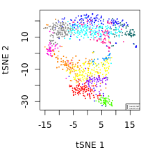
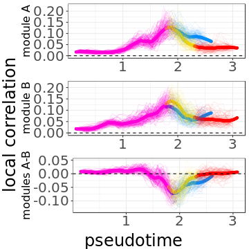

# Analysis of bifurcation points

This vignette describes analysis of individual bifurcation points based on a reconstructed transcriptional tree. As example, it explores bifurcation point between sensory and autonomic nervous systems in neural crest. The guideline starts with tree reconstruction, identifies fate-specific genes and estimates timing of their activation, assess existence and formation of fate-biases, and predicts time of genes inclusion in fate-biased phase.

## Preliminaries: loading the libraries and neural crest data


```r
library(igraph)
library(mgcv)
library(quadprog) 
library(pcaMethods) 
library(Rcpp) 
library(inline) 
library(RcppArmadillo) 
#library(Rfast)
library(crestree)
library(ggplot2); library(gridExtra); library(grid);

data(crest)
emb <- crest$emb
clcol <- crest$clcol
nc.cells <- crest$nc.cells
wgm <- crest$wgm
wgwm <- crest$wgwm # matrix of expression weights
fpm <- read.table("http://pklab.med.harvard.edu/ruslan/neural_crest/fpm.txt",header=TRUE)
fpm <- as.matrix(fpm)
```
  
## Run tree reconstruction
The detailed guide for tree reconstruction is described in https://github.com/hms-dbmi/crestree/blob/master/vignettes/tree_guide.md. The tree can be either manually reconstructed:

```r
M <- length(nc.cells); 
lambda <- 250; 
sigma <- 0.04
ppt <- ppt.tree(X=wgm[,nc.cells], W=wgwm[,nc.cells], emb=emb, lambda=250, sigma=0.04, metrics="cosine", M=M,
                err.cut = 5e-3, n.steps=30, seed=1, plot=FALSE)
ppt <- cleanup.branches(ppt,tips.remove = c(139,295))
ppt <- setroot(ppt,355)
ppt <- project.cells.onto.ppt(ppt,n.mapping = 100)
```

Alternatively, the tree object used in the paper can be downloaded from:

```r
ppt <- readRDS(url("http://pklab.med.harvard.edu/ruslan/neural_crest/tree_structure_full.rds"))s
## Error: <text>:1:96: unexpected symbol
## 1: ppt <- readRDS(url("http://pklab.med.harvard.edu/ruslan/neural_crest/tree_structure_full.rds"))s
##                                                                                                    ^
```

## Identification of branch-specific genes

Bifurcation point is charactarized by a progenitor and derivative branches.

```r
plotppt(ppt,emb,tips=TRUE,forks=FALSE,cex.tree = 0.2,lwd.tree = 2)
```


We thus start with selection a root of progenitor branch (355) and two leaves of derivative branches (165 and 91):

```r
root <- 355
leaves <- c(165,91)
```

Here is fork charactarizing sensory-autonomic bifurcation point:

```r
subtree <- extract.subtree(ppt,c(root,leaves))
plotppt(ppt,emb,tips=TRUE,forks=FALSE,cex.tree = 0.2,lwd.tree = 4,subtree=subtree)
```


A routine `test.fork.genes` performs assessment of genes differentially expression between post-bifurcation branches:

```r
fork.de <- test.fork.genes(ppt,fpm,root=root,leaves=leaves,n.mapping = 10,n.cores=30)
```

A table `fork.de` contains summary statistics of fold change `effect`, p-value `p` and adjusted p-value `fdr`  of differential expression between branches, magnitude `pd1.a` (`pd2.a`) and p-value `pd1.p` (`pd2.p`) of expression changes from derivative branch 1 (2) to progenitor branch:

```r
head(fork.de[order(fork.de$p),],)
```


```r
knitr::kable(head(fork.de[order(fork.de$p),],))
```


|         |     effect|  p| fdr|  st| stf|     pd1.a|     pd1.p|      pd2.a|     pd2.p|
|:--------|----------:|--:|---:|---:|---:|---------:|---------:|----------:|---------:|
|Neurog2  |  1.8920098|  0|   0| 1.0| 1.0| 1.0819870| 0.0000000| -0.2581314| 0.0001524|
|Pcdh8    |  1.1686135|  0|   0| 0.9| 0.9| 0.5379139| 0.0000000| -0.1932169| 0.0000136|
|Hsd11b2  | -1.5014367|  0|   0| 1.0| 1.0| 0.0756059| 0.1867864|  0.9509055| 0.0000000|
|Dll1     |  1.4122592|  0|   0| 1.0| 1.0| 1.0439245| 0.0000000|  0.0508581| 0.3153041|
|Eya2     |  1.0354457|  0|   0| 1.0| 1.0| 0.7724607| 0.0000000|  0.0907785| 0.0000790|
|Ppp1r14a |  0.9542321|  0|   0| 1.0| 1.0| 0.9800075| 0.0000000|  0.3571761| 0.0000000|

We next consider a gene to be preferentially expressed along the first (second) branch if it has `effect.b1` (`effect.b2`) increased expression compared to another post-bifurcation branch and significant increase (p < 0.05) relative to progenitor branch:


```r
fork.de <- branch.specific.genes(fork.de,effect.b1 = 0.1,effect.b2 = 0.3)
```

Column `state` characterizes genes that are specific to first (1), second (2), or neither (0) of derivative branches.

```r
genes.sensory <- rownames(fork.de)[fork.de$state==1]
genes.autonomic  <- rownames(fork.de)[fork.de$state==2]
```

For consistency with the original results, we also limit genes to `genes.tree` set associated with the tree:

```r
genes.sensory <- intersect(genes.sensory,genes.tree)
str(genes.sensory)
##  chr [1:98] "Rdh10" "Hes6" "Cxcr4" "Nfasc" "5730559C18Rik" "Zbtb18" ...

genes.autonomic <- intersect(genes.autonomic,genes.tree)
str(genes.autonomic)
##  chr [1:126] "Speg" "Serpine2" "Lrrfip1" "Cdh19" "Ralb" "Angptl1" ...
```

## Classification of early and late modules

Dynamics of gene expression is reflected in timing of activation and expression optimum. Routine `activation.fork` estimates timing of optimum expression of smoothed expression and activation point as a first passage of derivative through `deriv.cutoff` cutoff:


```r
fork.de.act <- activation.fork(ppt,fork.de,fpm,root,leaves,deriv.cutoff = 0.015,n.mapping=10,n.cores=10)
```

`fork.de.act` table provides additional columns `optimum` and `activation` for genes predicted to be differentially expressed (`stat` = 1 or 2).

Branch-specific sets of genes (`genes.sensory` and `genes.autonomic`) can now be partitioned in early and late genes based on time of expression activation. A logical solution is to orient early/late genes relative to bifurcation point. Timing of root, bifurcation point and leaves are


```r
fork.pt(r,root,leaves)
```


```r
knitr::kable(t(fork.pt(r,root,leaves)))
```


| root| bifurcation|  leave 1|  leave 2|
|----:|-----------:|--------:|--------:|
|    0|     17.5719| 27.59971| 31.49521|

We use `cutoff = 16.0` on timing of activation to define early and late genes:

```r
genes.sensory.late <- genes.sensory[fork.de.act[genes.sensory,]$activation > cutoff]
genes.sensory.early <- setdiff(genes.sensory,genes.sensory.late)

genes.autonomic.late <- genes.autonomic[fork.de.act[genes.autonomic,]$activation > cutoff]
genes.autonomic.early <- setdiff(genes.autonomic,genes.autonomic.late)
```

Now we can check if early/late genes modules follow co-activation or mutually-exclusive patterns:


```r
cells <- rownames(ppt$cell.summary)[ppt$cell.summary$seg %in% extract.subtree(ppt,c(root,leaves))$segs]
par(mfrow=c(1,2))
plot(t(programs[c(1,3),cells]),col=ppt$cell.summary[cells,]$color,pch=19,cex=0.5)
plot(t(programs[c(2,4),cells]),col=ppt$cell.summary[cells,]$color,pch=19,cex=0.5)
## Error in plot.window(...): need finite 'xlim' values
```


## Coordination of fate biases

Co-activation of both fate-specific programs poses a question of when cell acquire bias in favor of one or another program. For that, we look for coordinated expression of each module inside more homogeneous subpopulations. First, bifurcation fork is partitioned in non-intersecting windows of `wind` cells:

```r
freq <- slide.cells(ppt,root,leaves,wind=50,n.cores=10)
```
Visualization of group of cells assigned to each non-intersecting window:

```r
fig_cells <- fig.cells(emb,freq)
marrangeGrob( c(fig_cells),ncol=length(fig_cells),nrow=1,top=NA)
```


Windows can be also selected manually, below we follow selection used in the paper:

```r
regions = list( list(7,151,200,1),list(7,101,151,1),list(7,51,100,1),list(7,1,50,1),list(list(6,5,1,2),1,50, -1),list(list(6,5,1,2),51,100, -1),list(5,1,50,1),list(1,1,50,1))
```


```r
freq <- slide.cells(ppt,root,leaves,wind=50,regions=regions,n.cores=10)
fig_cells <- fig.cells(emb,freq)
marrangeGrob( c(fig_cells),ncol=length(fig_cells),nrow=1,top=NA)
```


Next, routine `slide.cors` estimates average correlation of each early fate-specific gene with both modules (`genes.sensory.early` and `genes.autonomic.early`) in each window of cells:

```r
cors <- slide.cors(freq,fpm,genes.sensory.early,genes.autonomic.early)
```

Now joint visualization enables tracking how genes of fate-specific modules coordinate expression during progression along pseudotime:

```r
fig_cor <- fig.cors(cors,genes.sensory.early,genes.autonomic.early)
marrangeGrob( c(fig_cells,fig_cor),ncol=length(fig_cells),nrow=2,
              layout_matrix = matrix(seq_len(2*length(fig_cells)), nrow = 2, ncol = length(fig_cells),byrow=TRUE),top=NA)
```


  
To obtain more contrasted (and reproducible with the paper) view, a set of early genes could be further cleaned up by removing fate-specific genes having low correlation with its modules around bifurcation point:

```r
corA <- cors[[5]][,1]
genesetA <- names(which(corA[genes.sensory.early] > 0.07))

corB <- cors[[5]][,2]
genesetB <- names(which(corB[genes.autonomic.early] > 0.07))
```

Re-estimation average window-specific correlations for cleaned up sets of genes `genesetA` and `genesetB`:

```r
cors <- slide.cors(freq,fpm,genesetA,genesetB)
fig_cor <- fig.cors(cors,genesetA,genesetB)
marrangeGrob( c(fig_cells,fig_cor),ncol=length(fig_cells),nrow=2,
              layout_matrix = matrix(seq_len(2*length(fig_cells)), nrow = 2, ncol = length(fig_cells),byrow=TRUE),top=NA)
```




More generally, formal trends of local coordination of fate-specific modules along branching trajectories can be estimated using `synchro` routine:


```r
w=30
step=10
crd <- synchro(ppt,fpm,root,leaves,genesetA,genesetB,w,step,n.mapping=100,n.points = 300,span.smooth = 0.1,perm=FALSE)
```
And visualized:

```r
visualize.synchro(crd)
```




