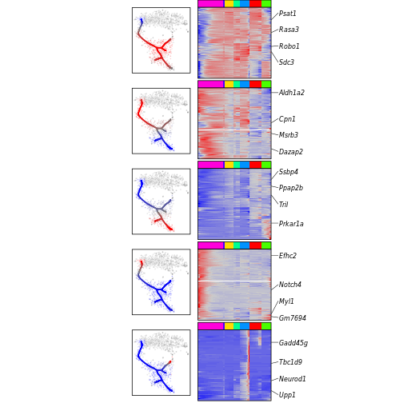
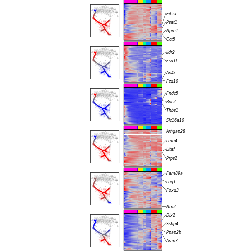
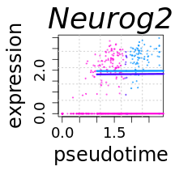
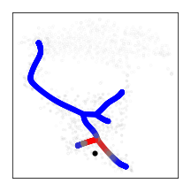
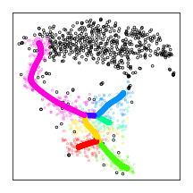
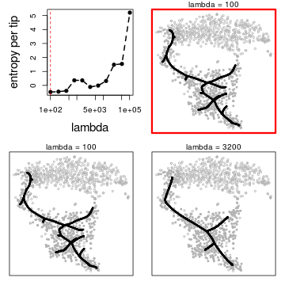
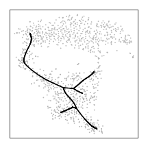
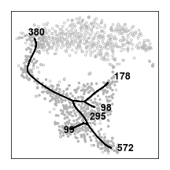
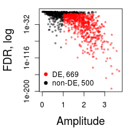
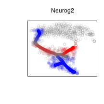

# Analysis of branching trajectories

This vignette describes tree reconstruction procedure and basic routines to explore gene expression patterns associated with the tree. It demonstrates application of the tree analysis to neural crest system. The guideline starts with processed data, including normalized gene expression matrix and t-SNE embedding, shows how to reconstruct the tree, analyse transcriptional events along the tree and provides a number of visualization routines. 

## Preliminaries: loading the libraries


```r
library(igraph)
library(mgcv)
library(quadprog) 
library(pcaMethods) 
library(Rcpp) 
library(inline) 
library(RcppArmadillo) 
#library(Rfast)

library(crestree)
```
  
## Loading the data
Tree reconstruction requires a gene expression matrix. Addditionally, exploration of the tree on top of existing 2D embedding significantly simplifies interpretation. It is thus important to provide embedding of cells (e.g. t-SNE, PCA etc.). The following command uploads processed neural crest data, including expression matrix and t-SNE embedding:

```r
data(crest)
```
Data list `crest` contains embedding `emb`, colors of clusters `clcol` and a vector of neural crest-derived cells `nc.cells` in the dataset:

```r
emb <- crest$emb
str(emb)
##  num [1:1107, 1:2] 5.67 5.07 -1.17 0.78 -4.11 ...
##  - attr(*, "dimnames")=List of 2
##   ..$ : chr [1:1107] "p85_A10" "p85_A11" "p85_A12" "p85_A13" ...
##   ..$ : NULL
```


```r
clcol <- crest$clcol
str(clcol)
##  Named chr [1:1107] "#49FF00FF" "#0000FFFF" "#0000FFFF" "#FF0000FF" ...
##  - attr(*, "names")= chr [1:1107] "p85_A10" "p85_A11" "p85_A12" "p85_A13" ...
```


```r
nc.cells <- crest$nc.cells
str(nc.cells)
##  chr [1:589] "p85_A10" "p85_A13" "p85_A14" "p85_A15" "p85_A17" ...
```
Here is a visualization of embedding with cells colored by clusters, and discriminated neural crest and neural tube cells:

```r
par(mfrow=c(1,1),mar=c(4,4,1,1))
plot(crest$emb,col=crest$clcol,pch=ifelse( rownames(crest$emb)%in%crest$nc.cells,19,1),cex=0.2,xlab="tSNE 1",ylab="tSNE 2")
legend("bottomright",c("neural crest","neural tube"),pch=c(19,1),cex=0.2)
```


The data `crest` contains matrix of expression levels normalized to cell size `fpm` and expression levels adjusted for mean-variance trend `wgm`:

```r
fpm <- crest$fpm

str(fpm)
##  num [1:1169, 1:1107] 0 0 0 2.18 0 ...
##  - attr(*, "dimnames")=List of 2
##   ..$ : chr [1:1169] "1700011H14Rik" "1700019D03Rik" "1810011O10Rik" "2010315B03Rik" ...
##   ..$ : chr [1:1107] "p85_A10" "p85_A11" "p85_A12" "p85_A13" ...
```


```r
wgm <- crest$wgm

str(wgm)
##  num [1:1169, 1:1107] -1.356 -1.037 -1.362 1.679 -0.841 ...
##  - attr(*, "dimnames")=List of 2
##   ..$ : chr [1:1169] "1700011H14Rik" "1700019D03Rik" "1810011O10Rik" "2010315B03Rik" ...
##   ..$ : chr [1:1107] "p85_A10" "p85_A11" "p85_A12" "p85_A13" ...

wgwm <- crest$wgwm # matrix of expression weights
```
Of note, matrices contain only 1169 the most over-dispersed genes. Alternatively, we can upload the full matrix from a web server:

```r
fpm <- read.table("http://pklab.med.harvard.edu/ruslan/neural_crest/fpm.txt",header=TRUE)
fpm <- as.matrix(fpm)

str(fpm)
##  num [1:15427, 1:1107] 2.87 2.08 1.99 0 2.13 ...
##  - attr(*, "dimnames")=List of 2
##   ..$ : chr [1:15427] "Mrpl15" "Lypla1" "Tcea1" "Rgs20" ...
##   ..$ : chr [1:1107] "p85_A10" "p85_A11" "p85_A12" "p85_A13" ...
```


## Running tree reconstruction
Algorithm has a number of important parameters to be selected (they can be defined by default, but it is good to have control over them), in particular cell-cell distance `metrics` (cosine-based or euclidean), number of tree principal points (PPs) `M` and tree parameters `lambda` (stringency of the tree) and `sigma` (fuzziness of cells to principal points assignment):

```r
metrics <- "cosine" 
M <- length(nc.cells) # use as many pricipal points as the number of cells
```

Now we can model a parsimonious tree using `fpm` experssion matrix:

```r
lambda <- 150
sigma <- 0.015

z <- ppt.tree(X=fpm[rownames(wgm),nc.cells], emb=emb, lambda=lambda, sigma=sigma, metrics=metrics, M=M, err.cut = 5e-3, n.steps=50, seed=1, plot=FALSE)
```

The reconstructed tree `z`, that is modeled in high-dimensional expression space, can be visualized on top of embedding `emb` using `plotppt` routine:

```r
plotppt(z,emb,tips=FALSE,cex.tree = 0.1,cex.main=0.2,lwd.tree = 1)
```


We next switch to expression matrix `wgm` with weights `wgmw` used in the paper. Of note, optimal tree parameters `lambda` and `sigma` are sensitive to the data properties, such as dataset size or choice of expression matrices. In section **"Selection of optimal tree parameters"** we discuss a strategy of parameters selection and suggest two guiding routines. Below the tree is modeled and visualized with a new choice of expression matrices:

```r
lambda <- 250
sigma <- 0.04
ppt <- ppt.tree(X=wgm[,nc.cells], W=wgwm[,nc.cells], emb=emb, lambda=250, sigma=0.04, metrics="cosine", M=M,
                err.cut = 5e-3, n.steps=30, seed=1, plot=FALSE)

plotppt(ppt,emb,tips=FALSE,cex.tree = 0.1,cex.main=0.2,lwd.tree = 1)
```




Optionally, stable properties of the tree can be assessed using sampling of cells. Below we generate 20 trees through subsampling of 90% of cells without replacement:  

```r
ppt_ensemble <- bootstrap.ppt(X=wgm[,nc.cells], W=wgwm[,nc.cells], emb=emb, metrics=metrics, M=as.integer(length(nc.cells)*0.9), lambda=lambda, sigma=sigma, plot=FALSE,
                             n.samples=20,n.cores=20, seed=NULL,replace=FALSE)
```

Sampling of trees can be visualized on embedding using routing `plotpptl`:

```r
plotpptl(ppt_ensemble,emb, cols=adjustcolor("grey",alpha=0.1),alpha=0.05, lwd=1)
```



## Tree processing
Now we can prepare the tree for downstream analysis. For that, we will remove small spurious branches, orient the tree by assigning a root and project cells onto the tree.

While major stable branches reflect biologically strong signal, small spurious branches likely reflect artifacts or incomplete convergence of the algorithm. Tips and forks of the tree can be explored on top of the embedding with flags `tips=TRUE` and `forks=TRUE` that show ids of principal points of tips and forks. For example, visually five leaves `(380, 178, 98, 99, 572)` correspond to notable branches, while leave `295` reflects spurious branch:

```r
plotppt(ppt,emb,tips=TRUE,forks=FALSE,cex.tree = 0.2,lwd.tree = 2)
```


Spurious branchs are removed using `cleanup.branches` routine, which suggests a number of criterion to eliminate undesired branches. Below we retain only `tips.number` tips of the tree that maximally preserve the tree structure (alternatively, we could directly supply a vector of tip ids `tips.remove` for removal):

```r
#ppt <- t.cleanup.branches.new(ppt,tips.number = 5)
ppt <- cleanup.branches(ppt,tips.remove = c(139,295))
```
Of note, after removing spurious branches, numeration of the remaining principal point changes:

```r
plotppt(ppt,emb,tips=TRUE,forks=FALSE,cex.tree = 0.2,lwd.tree = 2)
```



The tree does not provide information about directionality of dynamics. Selection of a tree root with routine `setroot`  is sufficient to orient the tree:

```r
ppt <- setroot(ppt,root=355)
```

Finally, each cell is projected onto the tree. It provides estimates of a cell pseudotime and branch. Probabilistic position of a cell on the tree is naturally delivered by the method and stored in the field `R` of tree object. For example, probailistic distribution of a given cell on the tree is shown below:

```r
cell <- nc.cells[2] # choose a cell
pprobs <- ppt$R[cell,] # probabilities of tree projections
plotppt(ppt,emb,pattern.tree = ppt$R[cell,],cex.tree = 1,lwd.tree = 0.1) # plot probabilities using pattern.tree parameter
points(emb[cell,1],emb[cell,2],cex=1,pch=19,col="black") # show cell position on embedding
```




We next use routine `project.cells.onto.ppt` to assign maximum likelihood projection of each cell on the tree and estimate cells pseudotime (if `emb` is supplied than the routine plots cells colored by branch position). To account for uncertainty in cell projections, we can sample `n.mapping` probabilistic mappings of cells onto the tree:

```r
ppt <- project.cells.onto.ppt(ppt,emb,n.mapping = 100)
```




## Analysis of tree-associated genes
We are ready to study gene expression patterns along the tree. The first step is to identify genes that have expression levels significantly varied along the tree (tree-associated genes). Routine `test.associated.genes` estimates significance of each gene's association with the tree using an input expression matrix, e.g. `fpm`:

```r
ppt <- test.associated.genes(ppt,n.map=1,n.cores = 20,fpm,summary=TRUE)
```


A field `stat.association` of `ppt` provides summary statistics of genes association, including amplitude of changes along the tree  `A`, p-value `pval`, B-H adjustment for multiple testing `fdr` and binary classification `sign` of differential expression along the tree. Also, robustness of differential expression is estimated as a fraction `st` of probabilistic projections (if `n.mappings` > 1 in project.cells.onto.ppt) when a gene was detected as differentially expressed.

```r
head(ppt$stat.association[order(ppt$stat.association$pval),])
```


|       | pval|        A| fdr| st|sign |
|:------|----:|--------:|---:|--:|:----|
|Wnt3a  |    0| 3.398414|   0|  1|TRUE |
|Phox2b |    0| 3.011038|   0|  1|TRUE |
|Prrx1  |    0| 3.304847|   0|  1|TRUE |
|Sox10  |    0| 3.708473|   0|  1|TRUE |
|Rspo3  |    0| 3.650121|   0|  1|TRUE |
|Fli1   |    0| 2.407817|   0|  1|TRUE |

Only differentially expressed genes (TRUE in `sign`) are later used to model expression patterns along the tree. A set of differentially expressed genes can be manually modified in a column `sign`. In the original paper, differentially expressed genes (vector `genes.tree` in crest data) were estimated based on 100 probabilistic cell mappings, here we define only them as significant (to avoid time-consuming calculations):


Now expression levels of differentially expressed genes can be modeled as a function of pseudotime along the tree. 

```r
ppt <- fit.associated.genes(ppt,fpm,n.map=1,n.cores=20)
## [1] "fit gene expression for mapping 1"
## 
##     branch-monotonous      complex patterns transiently expressed 
##                   673                   112                   263
```

There are different ways to visualize expression trends of a gene along the tree. For example, as a function of pseudotime:

```r
gene <- "Neurog2"
visualise.trajectory(ppt,gene,fpm[gene,],cex.main = 3,lwd.t2=0.5)
```



The other way is to show how fitted expression levels `fit.summary` change along the tree on the embedding:

```r
par(mar=c(4,4,3,1))
plotppt(ppt,emb,pattern.cell = ppt$fit.summary[gene,],gene="Neurog2",cex.main=1,cex.tree = 1.0,lwd.tree = 0.1,par=FALSE)
```


We can now use matrix of expression profiles `fit.summary` smoothed along the tree to cluster differentially expressed genes and explore major tree-associated patterns of expression. First, lets select a subset of genes that have large magnitude of variability along the tree:

```r
genes <- rownames(ppt$stat.association)[ppt$stat.association$sign==TRUE & ppt$stat.association$A > 2]
```


```r
str(genes)
##  chr [1:257] "Rdh10" "Tfap2b" "Hs6st1" "Col3a1" "1700019D03Rik" "Igfbp5" "Pax3" "Sgpp2" "Cxcr7" "Hes6" ...
```

Then smoothed expression profiles can be clustered using a variety of methods. Clusters of genes can be explored using `visualise.clusters` visualization routine, using as a default hierarchical clustering with Ward linkage and cosine-based similarity with predefined number of `clust.n` clusters:

```r
visualise.clusters(ppt,emb,clust.n = 5,cex.gene=1,cex.cell=0.05,cex.tree=0.2)
```



Alternatively, it is possible to provide a vector of gene clusters for visualization. Below we use hierarchical clustering with euclidean distance to cluster genes:

```r
hc <- hclust(dist(ppt$fit.summary[genes.tree,]),method="ward.D") # hierarchical clustering
clust <- cutree(hc,6) # partition of genes in 4 clusters

str(clust)
##  Named int [1:1048] 1 2 3 4 2 3 3 3 4 5 ...
##  - attr(*, "names")= chr [1:1048] "Rpl7" "Rdh10" "Crispld1" "Tfap2b" ...
```
And supply a vector `clust` for visualizzation:

```r
visualise.clusters(ppt,emb,clust=clust,cex.gene=1,cex.cell=0.05,cex.tree=0.2)
```


## Analysis of subtree of interest

In some cases a subtree of the tree, for example a single trajectory, is of particular interest. A set of routines used to select subtree, visualize gene patterns along the subtree and provide genes associated with the subtree. Below we choose a single trajectory:

```r
plotppt(ppt,emb[,],tips=TRUE,tree.col = ppt$pp.info$color,forks=TRUE,cex.tree = 1,lwd.tree = 0.1) # visualize tree tips
```



```r
zseg <- extract.subtree(ppt,c("355","165")) # select root and terminal leave of the trajectory
```

Explore at expression patterns of a gene along selected subtree, defined by `zseg`, using additional parameter `subtree` with two visualization options:

```r
plotppt(ppt,emb,gene=gene,mat=fpm,cex.main=1,cex.tree = 1.5,lwd.tree = 0.1,subtree=zseg)
```


```r
visualise.trajectory(ppt,gene,fpm,cex.main = 3,subtree = zseg,lwd.t2=1)
```


We also can assess differential expression along the subtree:

```r
stat.subtree <- test.associated.genes(ppt,n.map=1,fpm,subtree = zseg)
```

Resulting `stat.subtree` is a summary table of genes associated with the subtree:

```r
head(stat.subtree[order(stat.subtree$pval),])
```


|         | pval|        A| fdr| st|sign |
|:--------|----:|--------:|---:|--:|:----|
|Ppp1r14a |    0| 2.301396|   0|  1|TRUE |
|Wnt3a    |    0| 3.398414|   0|  1|TRUE |
|Rspo3    |    0| 3.650121|   0|  1|TRUE |
|Sox10    |    0| 3.708473|   0|  1|TRUE |
|Cp       |    0| 3.145898|   0|  1|TRUE |
|Tfap2b   |    0| 3.120048|   0|  1|TRUE |

## Analysis of bifurcation point
A particularly interesting implication of the tree is analysis of bifurcation point. Usually, the first step of such analysis is infererence of genes that are differentially expressed between two post-bifurcaiton branches. Bifurcaiton point is formalized as a fork consisting of a root and two leaves. Below we select a root and two leaves:

```r
plotppt(ppt,emb,tips=TRUE,forks=FALSE,cex.tree = 0.2,lwd.tree = 2)
```




```r
root <- 355
leaves <- c(165,91)
```

A routine `test.fork.genes` performs assessment of genes differentially expression between post-bifurcation branches:

```r
fork.de <- test.fork.genes(ppt,fpm[,],root=root,leaves=leaves,n.mapping = 1,n.cores=30)
## testing differential expression between branches ..
## mapping 1
## testing upregulation in derivative relative to progenitor branch ..
```

A table `fork.de` contains summary statistics of fold change `effect`, p-value `p` and adjusted p-value `fdr`  of differential expression between branches, magnitude `pd1.a` and p-value `pd1.p` of expression changes from derivative branch 1 to progenitor branch:

```r
head(fork.de[order(fork.de$p),],)
```


|        |    effect|  p| fdr| st| stf|      pd1.a|     pd1.p|      pd2.a|     pd2.p|
|:-------|---------:|--:|---:|--:|---:|----------:|---------:|----------:|---------:|
|Fam71f2 |  0.025891|  0|   0|  1|   1| -0.0091337| 0.5964409| -0.0239106| 0.0222614|
|Neurog2 |  2.128871|  0|   0|  1|   1|  1.0819870| 0.0000000| -0.2581314| 0.0001524|
|Hsd11b2 | -1.693875|  0|   0|  1|   1|  0.0756059| 0.1867864|  0.9509055| 0.0000000|
|Srrm4   |  0.928124|  0|   0|  1|   1|  0.6634570| 0.0000000|  0.1075456| 0.0000487|
|Mcam    | -1.486911|  0|   0|  1|   1|  0.3521913| 0.0000001|  1.0221176| 0.0000000|
|Phox2b  | -1.297520|  0|   0|  1|   1|  0.0087856| 0.4096110|  0.9356242| 0.0000000|

Detailed analysis of bifurcation point is described in https://github.com/hms-dbmi/crestree/blob/master/vignettes/bifurcation_point.md

## Selection of optimal tree parameters
Choice of parameters `sigma` and `lambda` for tree reconstruction is of crucial importance. We suggest a combination of formal criteria and exploratory analysis for selection of parameters. First, parameter `sigma` is selected as an optimum of cross validation upon `lambda`=0:

```r
sig <- sig.explore(X=wgm[,nc.cells],metrics="cosine",sig.lims=seq(0.01,0.1,0.01),plot=TRUE)
```



Optimum sigma:

```r
sig
## [1] 0.04
```

Parameter `lambda` is selected upon optimal `sigma` using entropy criteria. However, the estimate is not fully robust. Using routine `lambda.explore` we additionally show trees for two intermediate `lambda` parameters and leave a final choice or further exploration to the user:

```r
lambda.stat <- lambda.explore(X=wgm[,nc.cells],M=length(nc.cells),metrics="cosine",emb=emb,sigma=sig,base=2)
```


